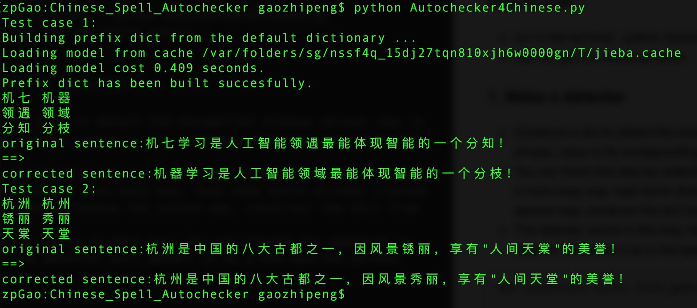

## Solutions of autochecker for chinese

### How to use :
- run in the terminal : python Autochecker4Chinese.py
- You will get the following result : 


### 1. Make a detecter

- Construct a dict to detect the misspelled chinese phrase，key is the chinese phrase, value is its corresponding frequency appeared in corpus.
- You can finish this step by collecting corpus from the internet, or you can choose a more easy way, load some dicts already created by others. Here we choose the second way, construct the dict from file. 
- The detecter works in this way: for any phrase not appeared in this dict, the detecter will detect it as a mis-spelled phrase.


```python
def construct_dict( file_path ):
    
    word_freq = {}
    with open(file_path, "r") as f:
        for line in f:
            info = line.split()
            word = info[0]
            frequency = info[1]
            word_freq[word] = frequency
    
    return word_freq
```


```python
FILE_PATH = "./token_freq_pos%40350k_jieba.txt"
phrase_freq = construct_dict( FILE_PATH )
```


```python
print( type(phrase_freq) )
print( len(phrase_freq) )
```

    <type 'dict'>
    349045


### 2. Make an autocorrecter
- Make an autocorrecter for the misspelled phrase, we use the edit distance to make a correct-candidate list for the mis-spelled phrase 
- We sort the correct-candidate list according to the likelyhood of  being the correct phrase, based on the following rules:
	- If the candidate's pinyin matches exactly with misspelled phrase's pinyin, we put the candidate in first order, which means they are the most likely phrase to be selected.
	- Else if candidate first word's pinyin matches with misspelled phrase's first word's pinyin, we put the candidate in second order.
	- Otherwise, we put the candidate in third order.

```python
import pinyin
```


```python
# list for chinese words
# read from the words.dic
def load_cn_words_dict( file_path ):
    cn_words_dict = ""
    with open(file_path, "r") as f:
        for word in f:
            cn_words_dict += word.strip().decode("utf-8")
    return cn_words_dict
```


```python
# function calculate the edite distance from the chinese phrase 
def edits1(phrase, cn_words_dict):
    "All edits that are one edit away from `phrase`."
    phrase = phrase.decode("utf-8")
    splits     = [(phrase[:i], phrase[i:])  for i in range(len(phrase) + 1)]
    deletes    = [L + R[1:]                 for L, R in splits if R]
    transposes = [L + R[1] + R[0] + R[2:]   for L, R in splits if len(R)>1]
    replaces   = [L + c + R[1:]             for L, R in splits if R for c in cn_words_dict]
    inserts    = [L + c + R                 for L, R in splits for c in cn_words_dict]
    return set(deletes + transposes + replaces + inserts)
```


```python
# return the phrease exist in phrase_freq
def known(phrases): return set(phrase for phrase in phrases if phrase.encode("utf-8") in phrase_freq)
```


```python
# get the candidates phrase of the error phrase
# we sort the candidates phrase's importance according to their pinyin
# if the candidate phrase's pinyin exactly matches with the error phrase, we put them into first order
# if the candidate phrase's first word pinyin matches with the error phrase first word, we put them into second order
# else we put candidate phrase into the third order
def get_candidates( error_phrase ):
    
    candidates_1st_order = []
    candidates_2nd_order = []
    candidates_3nd_order = []
    
    error_pinyin = pinyin.get(error_phrase, format="strip", delimiter="/").encode("utf-8")
    cn_words_dict = load_cn_words_dict( "./cn_dict.txt" )
    candidate_phrases = list( known(edits1(error_phrase, cn_words_dict)) )
    
    for candidate_phrase in candidate_phrases:
        candidate_pinyin = pinyin.get(candidate_phrase, format="strip", delimiter="/").encode("utf-8")
        if candidate_pinyin == error_pinyin:
            candidates_1st_order.append(candidate_phrase)
        elif candidate_pinyin.split("/")[0] == error_pinyin.split("/")[0]:
            candidates_2nd_order.append(candidate_phrase)
        else:
            candidates_3nd_order.append(candidate_phrase)
    
    return candidates_1st_order, candidates_2nd_order, candidates_3nd_order
```


```python
def auto_correct( error_phrase ):
    
    c1_order, c2_order, c3_order = get_candidates(error_phrase)
    # print c1_order, c2_order, c3_order
    if c1_order:
        return max(c1_order, key=phrase_freq.get )
    elif c2_order:
        return max(c2_order, key=phrase_freq.get )
    else:
        return max(c3_order, key=phrase_freq.get )
```


```python
# test for the auto_correct 
error_phrase_1 = "呕涂" # should be "呕吐"
error_phrase_2 = "东方之朱" # should be "东方之珠"
error_phrase_3 = "沙拢" # should be "沙龙"

print error_phrase_1, auto_correct( error_phrase_1 )
print error_phrase_2, auto_correct( error_phrase_2 )
print error_phrase_3, auto_correct( error_phrase_3 )
```

    呕涂 呕吐
    东方之朱 东方之珠
    沙拢 沙龙


### 3. Correct the misspelled phrase in a sentance 


- For any given sentence, use jieba do the segmentation, 
- Get segment list after segmentation is done, check if the remain phrase exists in word_freq dict, if not, then it is a misspelled phrase
- Use auto_correct function to correct the misspelled phrase
- Output the correct sentence


```python
import jieba
import string
import re
```


```python
PUNCTUATION_LIST = string.punctuation
PUNCTUATION_LIST += "。，？：；｛｝［］‘“”《》／！％……（）"
```


```python
def auto_correct_sentence( error_sentence, verbose=True):
    
    jieba_cut = jieba.cut(err_test.decode("utf-8"), cut_all=False)
    seg_list = "\t".join(jieba_cut).split("\t")
    
    correct_sentence = ""
    
    for phrase in seg_list:
        
        correct_phrase = phrase
        # check if item is a punctuation
        if phrase not in PUNCTUATION_LIST.decode("utf-8"):
            # check if the phrase in our dict, if not then it is a misspelled phrase
            if phrase.encode("utf-8") not in phrase_freq.keys():
                correct_phrase = auto_correct(phrase.encode("utf-8"))
                if verbose :
                    print phrase, correct_phrase
    
        correct_sentence += correct_phrase
    
    if verbose:
        print correct_sentence
    return correct_sentence
```


```python
err_sent = '机七学习是人工智能领遇最能体现智能的一个分知！'
correct_sent = auto_correct_sentence( err_sent )
```

    机七 机器
    领遇 领域
    分知 分枝
    机器学习是人工智能领域最能体现智能的一个分枝！


```python
print correct_sent
```

    机器学习是人工智能领域最能体现智能的一个分枝！


```python

```
